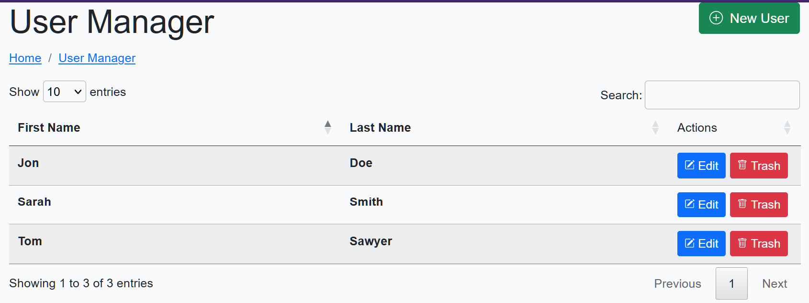

# CRUD <a href="https://gitpod.io/#https://github.com/gouniverse/crud" style="float:right;"></a>


A "plug-and-play" CRUD interface for GoLang that does its job and stays out of your way.

## Screenshots


## Usage

Create a handler like the example bellow, and attach to your router

```go
func crudHandler(w http.ResponseWriter, r *http.Request) {
	crudInstance, err := crud.NewCrud(crud.CrudConfig{
		Endpoint:           "/crud",
		HomeURL:            "/",
		EntityNameSingular: "User",
		EntityNamePlural:   "Users",
		ColumnNames:        []string{"First Name", "Last Name"},
		CreateFields: []crud.FormField{
			{
				Type:  "string",
				Label: "Name",
				Name:  "name",
			},
		},
		UpdateFields: []crud.FormField{
			{
				Type:  "string",
				Label: "First Name",
				Name:  "first_name",
			},
			{
				Type:  "string",
				Label: "Last Name",
				Name:  "last_name",
			},
		},
		FuncRows: func() ([]crud.Row, error) {
            // Your logic for fetching your users from DB
			return []crud.Row{
				{
					ID:   "ID1",
					Data: []string{"Jon", "Doe"},
				},
				{
					ID:   "ID2",
					Data: []string{"Sarah", "Smith"},
				},
				{
					ID:   "ID3",
					Data: []string{"Tom", "Sawyer"},
				},
			}, nil
		},
		FuncCreate: func(data map[string]string) (string, error) {
			// Your logic for creating a new user in DB
			return "ID4", nil
		},
		FuncUpdate: func(entityID string, data map[string]string) error {
			// Your Logic for updating an existing user in DB
			return nil
		},
		FuncTrash: func(entityID string) error {
			// Your logic for deleting an existing user in DB
			return nil
		},
		FuncFetchUpdateData: func(entityID string) (map[string]string, error) {
			// Your logic for fetching an existing user from DB
			return map[string]string{
				"first_name": "Charles",
                "last_name": "Dickens",
			}, nil
		},
	})

	if err != nil {
		w.Write([]byte(err.Error()))
		return
	}

	crudInstance.Handler(w, r)
}
```